class: title


Writing a ray tracer in F#
--------------------------

### Jack Matusiewicz

---

# Aim of the talk

1. To give you the information needed to write a simple ray tracer
1. To show you some F# code to do that. Hopefully showing you why F# was a good choice!

---

# What is a ray tracer?

* A way of producing images by generating light rays, firing them into an environment and simulating the reactions.

---

# How will our basic ray tracer work

1. We'll create a 2d array of pixels.
1. For each pixel:
    1. Create a light ray that is perpendicular to the pixel, fire it into the scene
    1. Check if the pixel intersects with an object
    1. If it does, colour the pixel with the shape's colour
    1. If it does not intersect with an object, colour the pixel black

---

# Vectors

* Directed line segments
* 3D vectors are represented with (x,y,z) components.
    * Don't confuse them with locations!
    * A vector is defined by a direction and a length.

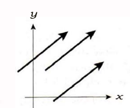
---


# Vectors

```f#
[<Struct>]
type Vector =
    {
        X : float
        Y : float
        Z : float
    } with

    static member (+) (lhs : Vector, rhs : Vector) : Vector =
        { X = lhs.X + rhs.X; Y = lhs.Y + rhs.Y; Z = lhs.Z + rhs.Z }

    static member (-) (lhs : Vector, rhs : Vector) : Vector =
        { X = lhs.X - rhs.X; Y = lhs.Y - rhs.Y; Z = lhs.Z - rhs.Z }

    static member (*) (a : Vector, b : Vector) : Vector =
        { X = a.X * b.X; Y = a.Y * b.Y; Z = a.Z * b.Z }

    static member (.*) (a : float, b : Vector) : Vector =
        { X = a * b.X; Y = a * b.Y; Z = a * b.Z }

[<Struct>]
type UnitVector = private UnitVector of Vector
```

---

# Static member operators
This is the only way to overload operators in F#

If you try to do it with modules....
```f#
module FirstModule =
    let (./.) (a : int) (b : int) = a + b

module SecondModule =
    let (./.) (a : float) (b : float) = a + b

module UsageModule =
    open SecondModule
    open FirstModule

    let foo () = 5. ./. 6.
```

You get...

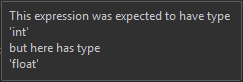

---

# Vector functions

```f#
[<RequireQualifiedAccess>]
module Vector =

    // Smart constructor for UnitVector
    let normalise (x : Vector) : UnitVector =
        let len = length x
        scalarDivide len x
        |> UnitVector

    // Implementing mathematical operations.
    let scalarMultiply (s : float) (x : Vector) = s .* x

    let dot (x : Vector) (y : Vector) =
        x.X * y.X + x.Y * y.Y + x.Z * y.Z

    let cross (a : Vector) (b : Vector) : Vector =
        {
            X = a.Y * b.Z - a.Z * b.Y
            Y = a.Z * b.X - a.X * b.Z
            Z = a.X * b.Y - a.Y * b.X
        }

    let scalarDivide (s : float) (x : Vector) =
        { X = x.X / s; Y = x.Y / s; Z = x.Z / s }

    let squaredLength (x : Vector) =
        x.X * x.X + x.Y * x.Y + x.Z * x.Z

    let length (x : Vector) =
        squaredLength x |> Math.Sqrt

```

---

# Tiny types with smart constructors

```f#
let normalise (x : Vector) : UnitVector =
    let len = length x
    scalarDivide len x
    |> UnitVector
```

Having a type that has private internals with only a smart constructor to create it saves you on testing.

All you have to do is test the constructor to ensure you create objects of the right type. After that, you can
assume it's correct in the rest of your codebase.

---

# UnitVector functions

```f#
[<RequireQualifiedAccess>]
module UnitVector =

    let toVector (UnitVector v) = v
```

---

# Points

* Points are locations in a space.

* For our purposes, points have 3 components (x,y,z)

---

# Points

```f#
[<Struct>]
type Point =
    {
        X : float
        Y : float
        Z : float
    } with

    static member (-) (lhs : Point, rhs : Point) : Vector =
        { X = lhs.X - rhs.X; Y = lhs.Y - rhs.Y; Z = lhs.Z - rhs.Z }

    static member (+) (lhs : Vector, rhs : Point) : Point =
        { X = lhs.X + rhs.X; Y = lhs.Y + rhs.Y; Z = lhs.Z + rhs.Z }

    static member (+) (point : Point, vector : Vector) : Point = vector + point

    override this.ToString () =
        sprintf "%.3f, %.3f, %.3f" this.X this.Y this.Z
```

---

# Light Ray

An infinite line, defined by a point in space, o, and a direction, d.

```f#
[<Struct>]
type Ray =
    {
        Origin : Point
        Direction : UnitVector
    }

module Ray =

    let getPosition
        (t : float)
        // You can pattern match on parameters to save you
        // explicitly writing boilerplate code in your function
        ({Origin = o; Direction = UnitVector d} : Ray)
        : Point
        =
        o + t .* d
```

---

# Colour

```f#
[<Struct>]
type Colour =
    {
        R : float
        G : float
        B : float
    } with

    static member (+) (l : Colour, r : Colour) : Colour =
        { R = l.R + r.R; G = l.G + r.G; B = l.B + r.B }

    static member (*) (l : Colour, r : Colour) : Colour =
        { R = l.R * r.R; G = l.G * r.G; B = l.B * r.B }

    static member (.*) (l : float, r : Colour) : Colour =
        { R = l * r.R; G = l * r.G; B = l * r.B }
```

---

# Colour functions

```f#
module Colour =

    let private clampToOne (c : Colour) : Colour =
        let maxValue = Math.Max (c.R, Math.Max (c.G, c.B))
        if maxValue > 1. then
            {
                R = c.R / maxValue
                G = c.G / maxValue
                B = c.B / maxValue
            }
        else c

    // We could well have gone outside of the [0,1] range so we need to ensure we are back
    // in that range before we display the image.
    let toColor (c : Colour) : Color =
        let { R = r; G = g; B = b } = clampToOne c
        (r * 255., g * 255., b * 255.)
        |> (fun (r,g,b) -> Color.FromArgb (255, (int r), (int g), (int b)))
```

---

# Shapes
This ray tracer will support two types of objects, spheres and planes.

* Planes are infinite sheets that can be uniquely defined by a point on the surface and the normal at that point
* Spheres are a set of points that are a distance, r, away from a center point, c.

---

# Shapes

```f#
[<Struct>]
type Sphere = { Center : Point; Radius : float }

[<Struct>]
type Plane = { Point : Point; Normal : UnitVector }

type Shape =
    | Sphere of Sphere
    | Plane of Plane

type SceneObject = { Shape : Shape; Colour : Colour }
```

---

# Keeping track of collisions

When we've found a collision, we need to keep track of some information that'll be used later to colour the pixels

```f#
[<Struct>]
type internal CollisionRecord =
    {
        /// The parameter to plug into the ray calculation
        T : float
        /// The collision point on the surface of the object
        CollisionPoint : Point
        /// The normal of the object at the collision point
        Normal : UnitVector
        /// The colour of the object
        Colour : Colour
    }
```
---

# Keeping track of collisions

```f#
module CollisionRecord =

    let private tryMake
        (minT : float) (t : float) (r : Ray)
        (n : UnitVector) (c : Colour)
        : CollisionRecord option
        =
        if t > minT then
            {
                T = t
                CollisionPoint = Ray.getPosition t r
                Normal = n
                Material = c
            } |> Some
        else None
```

---

# Plane intersection
Plane collision is easy to calculate, we know that a point, p, is on our plane (a, n) if:
$$(p - a) . n = 0$$
This is because if p is on the plane then the vector made by (p - a) will be perpendicular to the normal and the
dot product will be 0.

So, we can substitute our ray equation (o + td for any t) to get:
$$(o + td - a) . n$$
We can rearrange this to solve for t:
$$t = (a - o) . n / (d . n)$$

We can then substitute t into our ray equation to find the collision point

---

# Plane intersection

```f#
module internal Plane =

    let rayIntersects
        (p : Plane)
        (minT : float)
        (c : Colour)
        (r : Ray)
        : CollisionRecord option
        =
        let (UnitVector planeNormal) = p.Normal
        let dDotN = (Vector.dot (UnitVector.toVector r.Direction) planeNormal)
        // If the ray is parallel to the plane, we definitely won't intersect.
        if dDotN = 0. then
            None
        else
            let t =
                // (a - o) . n / d . n
                (Vector.dot (p.Point - r.Position) planeNormal) / dDotN
            CollisionRecord.tryMake minT t r p.Normal c
```

---

# Sphere intersection

A point, p, lies on the surface of a sphere (c, r) if:
    $$(p - c) . (p - c) - r^{2} = 0$$
Again, we need to substitute the ray equation, o + td
    $$(o + td - c) . (o + td - c) - r^{2} = 0$$

Expanding and rearranging, we get:
    $$t^2 (d.d) + t (2 (o - c) . d) + (o - c) . (o - c) - r^{2} = 0$$

This is a quadratic equation for t.

So, we can find the roots for this equation!
    $$x = \frac{{ - b \pm \sqrt {b^2 - 4ac} }}{2a}$$

---
# Sphere intersection

So, the discriminant, $$b^{2} - 4ac$$ will tell us how many real roots we have:

`< 0` means we have none,

`= 0` means we have one

`> 0` means we have two

---

# Sphere intersection

```f#
module internal Sphere =

    let rayIntersects
        (minT : float)
        ({Direction = UnitVector rayDir} as r : Ray)
        (colour : Colour)
        (s : Sphere)
        =
        let aMinusC = r.Position - s.Center

        // Calculating the terms for the quadratic equation formula
        let a = Vector.dot rayDir rayDir
        let b = 2. * Vector.dot aMinusC rayDir
        let c = Vector.dot aMinusC aMinusC - (s.Radius * s.Radius)
        let discriminant = b * b - 4. * a * c
        if discriminant < 0. then
            None
        else
            let firstT = (-b - Math.Sqrt discriminant) / (2. * a)
            let secondT = (-b + Math.Sqrt discriminant) / (2. * a)
            let firstNormal = (Ray.getPosition firstT r) - s.Center |> Vector.normalise
            let secondNormal = (Ray.getPosition secondT r) - s.Center |> Vector.normalise

            CollisionRecord.tryMake minT firstT r firstNormal colour
            |> Option.orElse (CollisionRecord.tryMake minT secondT r secondNormal colour)
```

```f#
let orElse (ifNone : 'a option) (thenUse : 'a option) : 'a
```

---

# Putting collisions together

```f#
[<RequireQualifiedAccess>]
module Shape =

    let collides (minT : float) (r : Ray) (s : SceneObject) =
        match s.Shape with
        | Sphere sp ->
            Sphere.rayIntersects minT r s.Colour sp
        | Plane p ->
            Plane.rayIntersects p minT s.Colour r
```

---

# View plane

This is how we will generate our 2D array of pixels.
We can use it to generate a list of x,y coordinates for the pixels in question.
For the time being, our view plane will be parallel to the xy-plane and perpendicular to the z-axis.
The centre of our view plane will also go through the origin.

We'll view our pixels as unit squares, to keep things simple

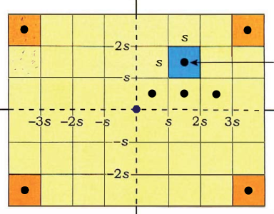

---

# View plane

```f#
[<Struct>]
type ViewPlane =
    {
        HorizontalResolution : int
        VerticalResolution : int
    }

module ViewPlane =

    let getXY (row : int) (col : int) (vp : ViewPlane) : float * float =
        let x = ((float col) - 0.5 * (float vp.HorizontalResolution) + 0.5)
        let y = ((float row) - 0.5 * (float vp.VerticalResolution) + 0.5)
        x,y

    let getRays (vp : ViewPlane) : Ray[,] =
        Array2D.init
            vp.VerticalResolution
            vp.HorizontalResolution
            (fun row col ->
                // Because we want 0,0 in the bottom left corner of our 2D array.
                let row = vp.VerticalResolution - row - 1
                let x,y = getXY row col vp
                {
                    Position = { X = x; Y = y; Z = 0. }
                    Direction = Vector.normalise {X = 0.; Y = 0.; Z = -1.}
                }
            )
```

---

# RECAP: How will our basic ray tracer work

1. We'll create a 2d array of pixels.
1. For each pixel:
    1. Create a light ray that is perpendicular to the pixel, fire it into the scene
    1. Check if the pixel intersects with an object
    1. If it does, colour the pixel with the shape's colour
    1. If it does not intersect with an object, colour the pixel black

---

# Constructing our scene

```f#
type Scene = { Objects : SceneObject list; ViewPlane : ViewPlane }

module Scene =

    let rec private getColourForRay
        (shapes : SceneObject list)
        (r : Ray)
        : Colour
        =
        let collisionPoints =
            List.map (Shape.collides 0. r) shapes
            |> List.choose id
        match collisionPoints with
        | [] ->
            { R = 0.; G = 0.; B = 0. }
        | vs ->
            let v =
                List.sortBy (fun hr -> hr.T) vs
                |> List.head
            v.Colour
        
    let toImage (scene : Scene) : unit =
        ViewPlane.getRays scene.ViewPlane
        |> Array2D.map (getColourForRay scene.Objects)
        |> Image.save "foo"
```
---

# Creating the objects

```f#
let shapes =
    [
        {
            Shape =
                Sphere { Center = { X = 0.; Y = 0.; Z = -1550. }; Radius = 300. }
            Colour = { R = 0.; G = 1.; B = 0. }
        }
        {
            Shape = Sphere { Center = { X = 0.; Y = 0.; Z = -900. }; Radius = 300. }
            Colour = { R = 1.; G = 0.; B = 0. }
        }
        {
            Shape =
            Plane
                {
                    Point = { X = 0.; Y = -300.; Z = 0. }
                    Normal = Vector.normalise { Vector.X = 0.; Y = 1.; Z = 0. }
                }
            Colour = { R = 0.5; G = 0.5; B = 0.25 }
        }
    ]
```

---

# Rendering the scene

```f#
let testScene () =
    {
        ViewPlane = { HorizontalResolution = 1920; VerticalResolution = 1080 }
        Objects = shapes
    }
    |> Scene.toImage
```

---

# And the result is

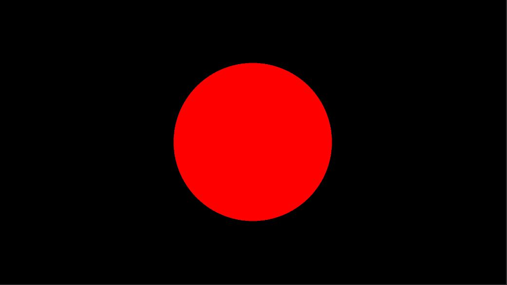

---

# Problem!

We finally have something rendered, which is great.
How can we see the green sphere?

---

# Movable camera

* In order to get a movable camera (with perspective) we'll move to using a virtual pinhole camera
* Unlike a pinhole camera in real life. The virtual camera doesn't flip the image

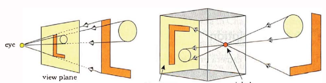

---

# Pinhole camera

Our pinhole camera will contain:

* The camera position
* A direction vector
* An "up" vector
* A view plane
* A distance between the view plane and the camera

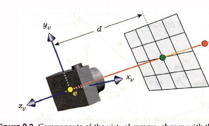
---

# Pinhole camera


We'll be using the direction vector and the "up" vector to construct a camera coordinate system that we can use to convert the view plane coordinates (which are in the camera coordinate system) to the world coordinate system.

---

# Orthonormal basis

* A set of unit vectors that are all perpendicular to one another.
* They form a right-handed coordinate system where
$$w = u \times v$$

* Can be constructed from any two non-parallel vectors, a and b:

$$w = \dfrac{a}{||a||}$$
$$u = \dfrac{b \times w}{||b \times w||}$$
$$ v = w \times u $$

---

# Orthonormal basis
The orthonormal basis we construct will be in world coordinates. This means that we can take any vector (x,y,z) in the camera coordinate system and convert it into world coordinates:


$$ xu + yv + zw $$

---

```f#
type internal OrthonormalBasis =
    {
        U : UnitVector
        V : UnitVector
        W : UnitVector
    }

module internal OrthonormalBasis =

    let make
        (UnitVector up : UnitVector)
        ((UnitVector w) as wUnitVector : UnitVector) =
        let u = Vector.cross up w
        let v = Vector.cross w u
        { U = Vector.normalise u; V = Vector.normalise v; W = wUnitVector }
```

---

# Pinhole camera construction

```f#
type Pinhole =
    internal {
        ViewPlane : ViewPlane
        CameraLocation : Point
        CameraDistance : float
        Onb : OrthonormalBasis
    }

[<RequireQualifiedAccess>]
module Pinhole =

    let make (vp : ViewPlane) (location : Point) (distance :float) (up : UnitVector)
        ((UnitVector direction) : UnitVector)
        : Pinhole
        =
        {
            ViewPlane = vp
            CameraLocation = location
            CameraDistance = distance
            Onb =
                OrthonormalBasis.make
                    up
                    (-1. .* direction |> Vector.normalise)
        }
```

---

# Pinhole camera usage

```f#
// Boring maths implementation
let private convertToWorldCoordinates x y z (onb : OrthonormalBasis) =
        let u = x .* UnitVector.toVector onb.U
        let v = y .* UnitVector.toVector onb.V
        let w = z .* UnitVector.toVector onb.W
        Vector.normalise (u + v - w)

    let makeRayProvider (pinhole : Pinhole) : unit -> Ray[,] =
        fun () ->
            Array2D.init
                pinhole.ViewPlane.VerticalResolution
                pinhole.ViewPlane.HorizontalResolution
                (fun r c ->
                    let r = pinhole.ViewPlane.VerticalResolution - r - 1
                    let x,y =
                        ViewPlane.getXY r c pinhole.ViewPlane
                    let dir =
                        convertToWorldCoordinates
                            x
                            y
                            pinhole.CameraDistance
                            pinhole.Onb
                    { Position = pinhole.CameraLocation; Direction = dir }
                )
```

---

# Updating the scene

```f#
type Scene =
    {
        Objects : SceneObject list
        GetCameraRays : unit -> Ray[,]
    }


[<RequireQualifiedAccess>]
module Scene =

    let rec private getColourForRay
        (shapes : SceneObject list)
        (r : Ray)
        : Colour
        =
        // no change
        
    let toImage (scene : Scene) : unit =
        scene.GetCameraRays ()
        |> Array2D.map (getColourForRay scene.Objects)
        |> Image.save "foo"
```

---

# Updating the scene object

```f#
let pinhole =
    Pinhole.make
        {
            HorizontalResolution = 1920
            VerticalResolution = 1080
        }
        { Point.X = -2000.; Y = 1000.; Z = -600. }
        500.
        ({ Vector.X = 0.; Y = 1.; Z = 0. } |> Vector.normalise)
        ({ Vector.X = 2000.; Y = -1000.; Z = 600. } |> Vector.normalise)

let testScene () =
    {GetCameraRays = Pinhole.makeRayProvider pinhole; Objects = shapes;}
    |> Scene.toImage
```

---

# Here's what we get

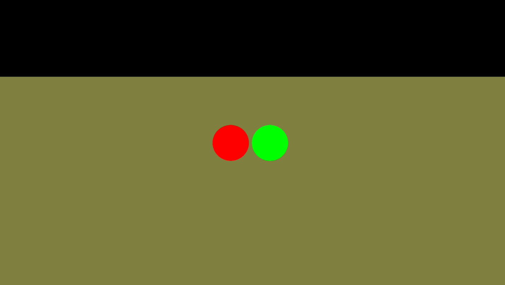

---

# Directional lighting


* Has no particular point in space
* All rays that come for a directional light source are parallel.
* The sun is (almost) an example of a directional light source because its rays on the earth's surface are (almost) parallel.

---


# Directional lighting

```f#
type DirectionalLight =
    internal {
        Direction : UnitVector
        Colour : Colour
        Luminosity : float
    }

type Light =
    | Directional of DirectionalLight
```

---

# Directional light functions

```f#
module DirectionalLight =

    let internal direction (dl : DirectionalLight) : UnitVector =
        dl.Direction

    let internal luminosity (dl : DirectionalLight) : Colour =
        Colour.scalarMultiply dl.Luminosity dl.Colour

    let make (direction : UnitVector) (colour : Colour) (luminosity : float) : DirectionalLight =
        { Direction = direction; Colour = colour; Luminosity = luminosity }
```

---

# Using lights

```f#
module Light =

    let direction (l : Light) : UnitVector =
        match l with
        | Directional d ->
            DirectionalLight.direction d

    let luminosity (l : Light) : Colour =
        match l with
        | Directional d ->
            DirectionalLight.luminosity d
```

---

# How the direction of light matters

* Imagine,rather than a collision point, it was a tiny area on the surface, let's call it dA.
* Let's also think about light hitting this area, there will be a finite number of photons being fired at this area of the surface (per unit of time)
* When the direction of light is parallel to the surface normal, all of the photons hit this area.
* As the angle between the surface normal and the direction of light increases, the area that the light hits begins to increase.
* As we have a finite number of photons being is constant, and they are hitting a larger area, the resulting colour we see will be dimmer.

* This can be summarised by Lambert's cosine law: $$\cos(\theta) = N . L$$

---

# How the direction of light matters

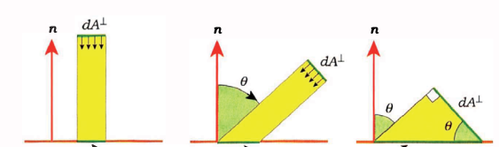

---

# Diffuse shading

* Light that hits a diffuse material is reflected in every direction equally.
* We've seen that the angle between the light and the normal also has an effect on the output.
* Shaders also include an *albedo* parameter. This is a measure of the proportion of light that is reflected from a surface.

* Putting it all together (and ignoring some maths), you get the following equation:

$$Colour = albedo \times (N. L) \times lightIntensity \times objectColour$$

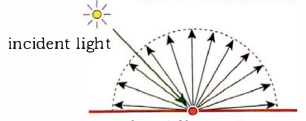

---

# Diffuse shading
```f#
type Lambertian =
    {
        Colour : Colour
        AlbedoCoefficient : float
    }

module Lambertian =

    let shade (UnitVector normal) (UnitVector inDirection) (l : Lambertian) =
        let angleBetweenVectors = Vector.dot normal inDirection
        if angleBetweenVectors < 0. then
            { R = 0.; G = 0.; B = 0. }
        else
        l.AlbedoCoefficient * angleBetweenVectors .* l.Colour
```

---

# Updating the world

```f#
type Scene =
    {
        Objects : SceneObject list
        Lights : Light list
        GetCameraRays : unit -> Ray[,]
    }
```


```f#
type SceneObject =
    {
        Shape : Shape
        Material : Lambertian
    }
```

```f#
[<Struct>]
type CollisionRecord =
    {
        /// The parameter to plug into the ray calculation
        T : float
        /// The collision point on the surface of the object
        CollisionPoint : Point
        /// The normal of the object at the collision point
        Normal : UnitVector
        /// The colour of the object
        Material : Lambertian
    }
```
And so on...

---

# Updating the scene logic

```f#
let shadeAtCollision (cr : CollisionRecord) (l : Light) : Colour =
        let dir =
            Light.direction l
            |> UnitVector.toVector
            |> Vector.scalarMultiply -1.
            |> Vector.normalise
        let lightRay = { Ray.Position = cr.CollisionPoint; Direction = dir }
        Lambertian.colour
            cr.Normal
            dir
            cr.Material
        |> (*) Light.luminosity l
```

---

# Updating the scene logic

```f#
let rec private getColourForRay
        (shapes : SceneObject list)
        (lights : Light list)
        (r : Ray)
        : Colour
        =
        let collisionPoints =
            List.map (Shape.collides 0. r) shapes
            |> List.choose id
        match collisionPoints with
        | [] ->
            { R = 0.; G = 0.; B = 0. }
        | vs ->
            let nearestCollision = List.sortBy (fun c -> c.T) vs |> List.head

            List.map (shadeAtCollision nearestCollision) lights
            |> List.fold (+) { R = 0.; G = 0.; B = 0.}
        
    let toImage (scene : Scene) : unit =
        scene.GetCameraRays ()
        |> Array2D.map (getColourForRay scene.Objects scene.Lights)
        |> Image.save "foo"
```

```f#
List.fold : ('state -> 'a -> 'state) -> 'state -> 'a list -> 'state
```

---

# Almost there!

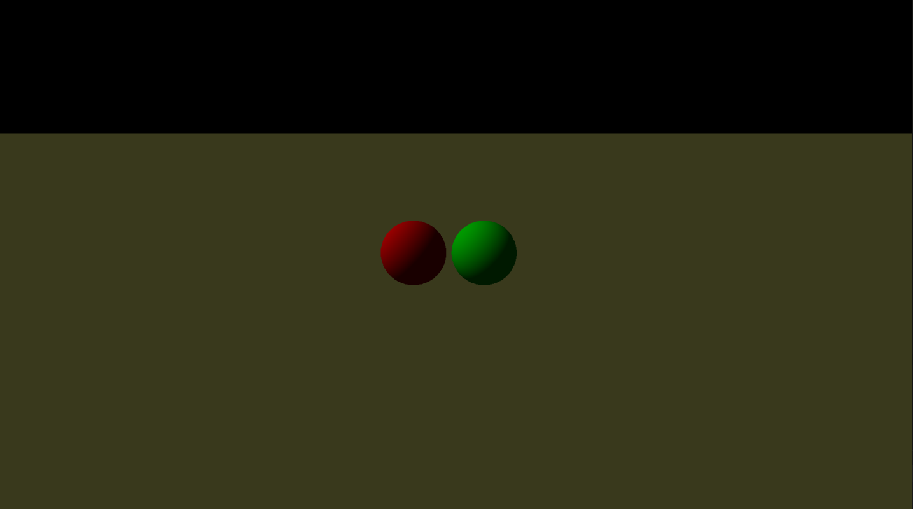

---

# Shadows

Shadows are surprisingly easy to implement.

At the moment we don't check if there is anything between the light source and the object.

---

# Updating the code

```f#
let private findClosestCollision
    (shapes : SceneObject list)
    (ray : Ray)
    : CollisionRecord option
    =
    List.map (Shape.collides 0. ray) shapes
    |> List.choose id
    |> function
        | [] -> None
        | cs ->
            List.sortBy (fun c -> c.T) cs
            |> List.head
            |> Some
```

```f#
function | a -> ... => match x with | a ->...
```
---

# Updating the code

```f#
let rec private getColourForRay
    (shapes : SceneObject list)
    (lights : Light list)
    (r : Ray)
    : Colour
    =
    findClosestCollision shapes r
    |> Option.map
        (fun collision ->
            List.map (shadeAtCollision shapes collision) lights
            |> List.fold (+) { R = 0.; G = 0.; B = 0.})
    |> Option.defaultValue { R = 0.; G = 0.; B = 0. }
```

```f#
Option.defaultValue : 'a -> 'a option -> 'a
```
---

# Updating the code

```f#
let private shadeAtCollision
    (sceneObjects : SceneObject list)
    (cr : CollisionRecord)
    (l : Light)
    : Colour
    =
    let dir =
        Light.direction l
        |> UnitVector.toVector
        |> Vector.scalarMultiply -1.
        |> Vector.normalise
    let lightRay = { Origin = cr.CollisionPoint; Direction = dir }

    match findClosestCollision sceneObjects lightRay with
    | None -> Lambertian.colour cr.Normal dir cr.Material
    | Some _ ->  { R = 0.; G = 0.; B = 0. }
    |> (+) (0.1 .* cr.Material.Colour) //Ambient colour
```

```f#
(-) 5 3 => 5 - 3
```

---

# So close

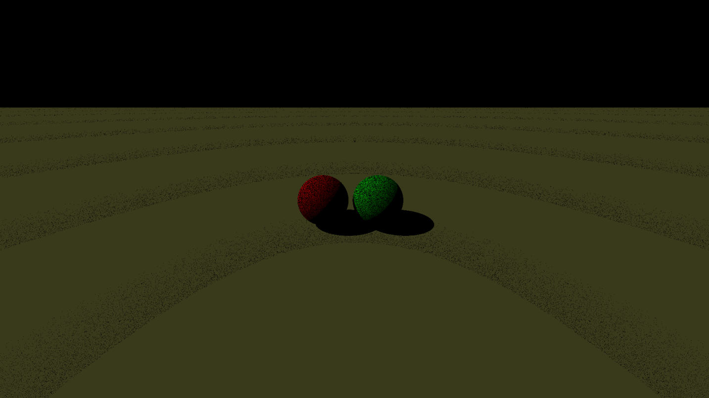

---

# Shadows

The issue is with my minT parameter.It's currently set to 0

This means that, sometimes, the shadow ray will intersect with the wrong object.

There's a simple solution..

---

# Fixing shadows

```f#
let private findClosestCollision
    (shapes : SceneObject list)
    (ray : Ray)
    : CollisionRecord option
    =
    List.map (Shape.collides 0.001 ray) shapes
    |> List.choose id
    |> function
        | [] -> None
        | cs ->
            List.sortBy (fun c -> c.T) cs
            |> List.head
            |> Some
```

---

# Finally!

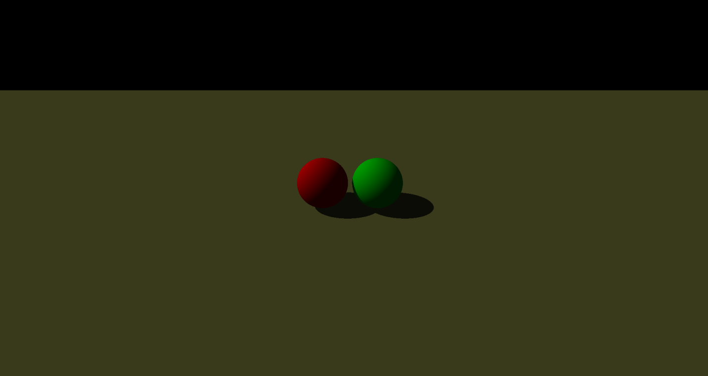

---

# Extras - Specular highlights

Obviously not all materials are matte, some are shiny.

In order to get that material we will need to implement the phong shader.

As you can see, objects with specular highlights will be a mix of both matte and glossy.

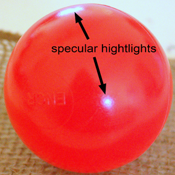

---

# Specular surfaces

* Unlike diffuse surfaces, that reflect light evenly in all directions. Specular reflections are clustered near the reflection vector

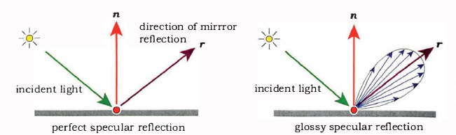

---

# Materials

In order to combine shaders to create more complex materials, an interface is required.

---

# Materials

```f#
type IMaterial =
    abstract Colour
        : normal:UnitVector
        -> inDirection:UnitVector
        -> outDirection:UnitVector
        -> lightLuminosity:Colour
        -> contactPoint:Point
        -> reflectionTrace:(Ray -> Colour)
        -> Colour

type Matte = inherit IMaterial
type Phong = inherit IMaterial
type Mirror = inherit IMaterial

[<RequireQualifiedAccess>]
module Matte =

    let make (lam : Lambertian) : Matte =
        { new Matte with
            member __.Colour (UnitVector normal) (UnitVector inD) _ luminosity _ _ =
                let ambient = 0.1 .* lam.Colour
                let nDotIn = Vector.dot normal inD
                if nDotIn < 0. then ambient
                else
                    let col = Lambertian.colour lam
                    nDotIn .* (luminosity * col + ambient)
        }
```


---
class: bold

# Thanks for listening!
